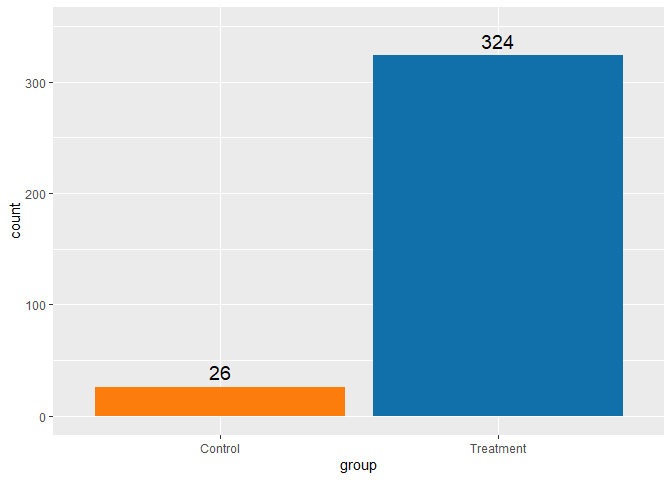
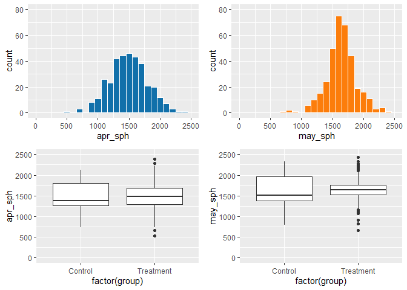
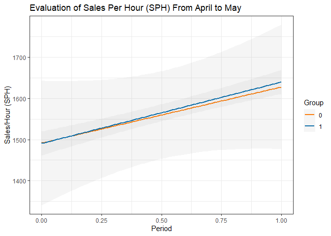
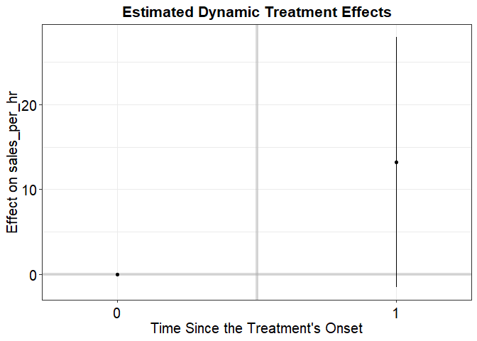
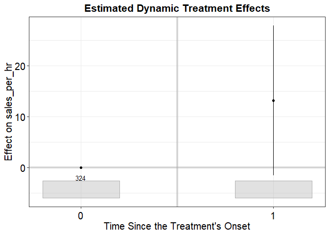

# Group IV Case Analysis


``` r
knitr::opts_chunk$set(echo = TRUE, message = FALSE, warning = FALSE)
if (!requireNamespace('pwr', quietly = TRUE)) {
    install.packages('pwr')
}

library(tidyverse)
```

    Warning: package 'purrr' was built under R version 4.5.2

    Warning: package 'forcats' was built under R version 4.5.2

    ── Attaching core tidyverse packages ──────────────────────── tidyverse 2.0.0 ──
    ✔ dplyr     1.1.4     ✔ readr     2.1.5
    ✔ forcats   1.0.1     ✔ stringr   1.6.0
    ✔ ggplot2   4.0.0     ✔ tibble    3.3.0
    ✔ lubridate 1.9.4     ✔ tidyr     1.3.1
    ✔ purrr     1.1.0     
    ── Conflicts ────────────────────────────────────────── tidyverse_conflicts() ──
    ✖ dplyr::filter() masks stats::filter()
    ✖ dplyr::lag()    masks stats::lag()
    ℹ Use the conflicted package (<http://conflicted.r-lib.org/>) to force all conflicts to become errors

``` r
library(gridExtra)
```


    Attaching package: 'gridExtra'

    The following object is masked from 'package:dplyr':

        combine

``` r
library(pwr)
```

    Warning: package 'pwr' was built under R version 4.5.2

``` r
library(plm)
```


    Attaching package: 'plm'

    The following objects are masked from 'package:dplyr':

        between, lag, lead

``` r
library(fect)
```

## Introduction

The Swedish retail company examined in this case study is considering
whether to transition its compensation structure from a monthly
incentive system to a more frequent, daily based incentive plan.
Leadership hopes that more immediate performance feedback may increase
productivity, sales volume, and overall employee engagement. An external
consultant initially evaluated this question using a
difference-in-percent (DiP) approach, comparing pre- and
post-performance levels across treated and control stores. While their
findings revealed that treated stores improved more than controls,
executive leadership requested a second opinion to determine whether
these conclusions were reliable and whether the data truly support
shifting to a daily incentive model.

To provide a thorough assessment, we conducted a structured analytical
review using difference-in-differences (DiD) methods: this approach was
specifically designed to estimate causal effects in settings with
pre/post data and comparison groups. Our process began with validating
the basic identification assumptions, especially the requirement that
treatment and control stores exhibit comparable pre-treatment
performance trends. We then used DiD regressions for key performance
outcomes such as sales, sales per hour (SPH), quantity sold, average
price, and return-to-sale ratios. Because of structural imbalances in
certain segments, we supplemented the regression models with clean
descriptive comparisons to capture meaningful patterns in the data. This
multilayered approach ensures that our conclusions rest on sound
statistical evidence rather than artifacts of percentage-based
comparisons.

The results of our analysis suggest that although treated stores show
slightly larger improvements in some metrics, these gains are modest,
statistically weak, and largely overshadowed by broader seasonal
patterns that affect all stores. Although treated stores show slightly
larger improvements in some performance metrics, these gains are modest,
statistically weak, and largely driven by seasonal variation rather than
the incentive change; therefore, the evidence does not support adopting
a daily incentive structure over the existing monthly system.

While the consultant’s descriptive DiP findings highlight apparent
differences, the more defensible DiD approach reveals that these effects
are smaller and less reliable than initially presented.

The sections that follow provide a data-driven comparison between the
consultant’s DiP-based conclusions and our DiD findings. By examining
the results across groups, performance metrics, and store segments, we
clarify where the original analysis aligns with the underlying data and
where it overstates the benefits of daily incentives. This
evidence-based breakdown equips leadership with a clearer understanding
of the true impact of incentive change and supports a more informed
policy decision.

## Define Outcome

$H_0:$ There is no difference in the average sales per hour between the
treatment group, `k`, and control group, `U`.

$H_a:$ There is a difference in the average sales per hour between the
treatment group, `k`, and control group, `U`.

## Load and Wrangle Data

``` r
# Create link to dataset
url <- 'https://raw.githubusercontent.com/pmwest7/case_study/refs/heads/main/synthetic_sales.csv'

# Read file into dataframe
data <- read.csv(url)
```

### Examine data structure

``` r
data |> glimpse()
```

    Rows: 350
    Columns: 15
    $ store_id     <int> 1, 1, 1, 1, 1, 2, 2, 2, 2, 2, 3, 3, 3, 3, 3, 4, 4, 4, 4, …
    $ sp_id        <chr> "C1_1", "C1_2", "C1_3", "C1_4", "C1_5", "C2_1", "C2_2", "…
    $ group        <chr> "Control", "Control", "Control", "Control", "Control", "C…
    $ segment      <dbl> NA, NA, NA, NA, NA, NA, NA, NA, NA, NA, NA, NA, NA, NA, N…
    $ apr_sph      <dbl> 1132.9752, 1757.8680, 1543.5580, 1006.7760, 1285.0843, 19…
    $ may_sph      <dbl> 1235.8060, 1918.2475, 1680.8747, 1095.0858, 1397.2640, 21…
    $ hours        <int> 140, 140, 140, 140, 140, 140, 140, 140, 140, 140, 140, 14…
    $ apr_sales    <dbl> 158616.5, 246101.5, 216098.1, 140948.6, 179911.8, 273573.…
    $ may_sales    <dbl> 173012.8, 268554.7, 235322.5, 153312.0, 195617.0, 298383.…
    $ apr_quantity <dbl> 99.73651, 97.76262, 102.88638, 100.42146, 99.15754, 101.2…
    $ may_quantity <dbl> 102.90220, 97.84933, 103.27513, 97.12049, 97.14230, 104.1…
    $ apr_price    <dbl> 200.8790, 202.6556, 200.2823, 201.0453, 197.7641, 216.776…
    $ may_price    <dbl> 194.4788, 209.1870, 202.9575, 198.6734, 196.8619, 226.283…
    $ apr_rts      <dbl> 0.012487583, 0.010280505, 0.009121699, 0.012065257, 0.010…
    $ may_rts      <dbl> 0.012022539, 0.011377622, 0.008717941, 0.010916106, 0.011…

### Examine Summary Statistics

``` r
data |> summary()
```

        store_id        sp_id              group              segment    
     Min.   : 1.00   Length:350         Length:350         Min.   :1.00  
     1st Qu.:19.00   Class :character   Class :character   1st Qu.:1.75  
     Median :41.00   Mode  :character   Mode  :character   Median :2.50  
     Mean   :41.07                                         Mean   :2.50  
     3rd Qu.:62.75                                         3rd Qu.:3.25  
     Max.   :84.00                                         Max.   :4.00  
                                                           NA's   :26    
        apr_sph          may_sph           hours       apr_sales     
     Min.   : 533.9   Min.   : 664.3   Min.   :140   Min.   : 74752  
     1st Qu.:1283.9   1st Qu.:1515.7   1st Qu.:140   1st Qu.:179747  
     Median :1482.6   Median :1639.4   Median :140   Median :207568  
     Mean   :1490.7   Mean   :1638.7   Mean   :140   Mean   :208701  
     3rd Qu.:1695.0   3rd Qu.:1768.3   3rd Qu.:140   3rd Qu.:237300  
     Max.   :2390.8   Max.   :2432.5   Max.   :140   Max.   :334718  
                                                                     
       may_sales       apr_quantity     may_quantity      apr_price    
     Min.   : 93008   Min.   : 95.44   Min.   : 93.90   Min.   :185.2  
     1st Qu.:212197   1st Qu.: 98.72   1st Qu.: 99.08   1st Qu.:197.0  
     Median :229512   Median :100.12   Median :101.78   Median :199.8  
     Mean   :229419   Mean   :100.00   Mean   :103.55   Mean   :200.0  
     3rd Qu.:247563   3rd Qu.:101.11   3rd Qu.:105.83   3rd Qu.:203.6  
     Max.   :340544   Max.   :104.54   Max.   :119.80   Max.   :216.8  
                                                                       
       may_price        apr_rts            may_rts          
     Min.   :174.2   Min.   :0.007309   Min.   :-0.0005185  
     1st Qu.:192.1   1st Qu.:0.009698   1st Qu.: 0.0016467  
     Median :197.4   Median :0.010477   Median : 0.0067505  
     Mean   :196.8   Mean   :0.010400   Mean   : 0.0074146  
     3rd Qu.:201.8   3rd Qu.:0.011082   3rd Qu.: 0.0116219  
     Max.   :226.3   Max.   :0.013296   Max.   : 0.0206198  
                                                            

### Transform Data

``` r
# Add new variable converting group assignments to binary 0/1
data <- data |>
  mutate(assignment = as.numeric(group == 'Treatment'))

# Create segments for control group
data <- data |>
mutate(segment =case_when(group == 'Control' ~ ntile(apr_sph, 4), group == 'Treatment' ~ segment))

data |> head()
```

      store_id sp_id   group segment  apr_sph  may_sph hours apr_sales may_sales
    1        1  C1_1 Control       1 1132.975 1235.806   140  158616.5  173012.8
    2        1  C1_2 Control       4 1757.868 1918.248   140  246101.5  268554.7
    3        1  C1_3 Control       3 1543.558 1680.875   140  216098.1  235322.5
    4        1  C1_4 Control       1 1006.776 1095.086   140  140948.6  153312.0
    5        1  C1_5 Control       2 1285.084 1397.264   140  179911.8  195617.0
    6        2  C2_1 Control       4 1954.095 2131.308   140  273573.4  298383.2
      apr_quantity may_quantity apr_price may_price     apr_rts     may_rts
    1     99.73651    102.90220  200.8790  194.4788 0.012487583 0.012022539
    2     97.76262     97.84933  202.6556  209.1870 0.010280505 0.011377622
    3    102.88638    103.27513  200.2823  202.9575 0.009121699 0.008717941
    4    100.42146     97.12049  201.0453  198.6734 0.012065257 0.010916106
    5     99.15754     97.14230  197.7641  196.8619 0.010844212 0.011718088
    6    101.20531    104.10392  216.7765  226.2836 0.011940652 0.011940582
      assignment
    1          0
    2          0
    3          0
    4          0
    5          0
    6          0

## Exploratory Data Analysis (EDA)

``` r
group_size <- ggplot(data, mapping = aes(x = group, label= ..count..)) +
  geom_bar(fill = c('#fc7d0b', '#1170aa')) +
  geom_text(stat = 'count', vjust=-0.5, size = 5) +
  ylim(0, 350)

group_size
```



``` r
group_segments <- data |>
  group_by(group = as.factor(group), segment) |>
  summarize(count = n(), .groups = 'drop')

ggplot(group_segments, mapping = aes(x = segment, y = count, fill= group)) +
  geom_col() +
   scale_fill_manual(values = c('#fc7d0b', '#1170aa')) +
   labs(title = 'Segmentation Distribution by Group') +
   geom_text(aes(label = count, y=count), vjust=-0.5, size = 3) + 
   facet_wrap(~ group)
```


``` r
# histogram of April sales per hour
apr_sales_per_hour <- ggplot(data, mapping = aes(x = apr_sph)) +
  geom_histogram(binwidth=100, color = '#ffffff', fill='#1170aa') +
  xlim(0, 2500) +
  ylim(0, 80)

# histogram of May sales per hour
may_sales_per_hour <- ggplot(data, mapping = aes(x = may_sph)) +
  geom_histogram(binwidth=100, color = '#ffffff', fill='#fc7d0b') +
   xlim(0, 2500) +
  ylim(0, 80)

apr_summary <- ggplot(data, mapping = aes(x = factor(group), y = apr_sph)) +
  geom_boxplot() +
  ylim(0, 2500)

may_summary <- ggplot(data, mapping = aes(x = factor(group), y = may_sph)) +
  geom_boxplot() +
  ylim(0, 2500)

grid.arrange(apr_sales_per_hour, may_sales_per_hour, apr_summary, may_summary, ncol=2, nrow=2)
```



## Difference-in-Percent (DiP) vs. Difference-in-Differences (DiD)

To see the impact of switching from a monthly- to a daily-quota plan,
Kjell & Company’s CEO, Thomas Keifer, consulted with an independent
sales compensation consultant, Anna Lindberg, who proposed a controlled
experiment. After a month of running the experiment, a
difference-in-percent (DiP) method was used to see the percentage (%)
change in SPH between April and May for both groups, treatment and
control (see below).

### Parallel Trends

``` r
# Create a new dataframe for use in evaluating the pre-treatment period for both the treated and untreated groups
pre_kU <- data |>
  select(assignment, apr_sph, apr_quantity, apr_price, apr_rts, segment) |> # append group values and April sales/hour to the new dataframe
  rename(sales_per_hr = apr_sph, quantity = apr_quantity, price = apr_price, rts = apr_rts) |> # append column to standardize sales per hour variable label
  mutate(time=0, # append a new variable, time, set equal to 1 to indicate the pre-period
         did_assign = assignment, # append a new variable and copy assignment values
         assignment = 0)# update assignment to 0 to indicate pre-treatment assignment


# Create a new dataframe for use in evaluating the post-treatment period for both the treated and untreated groups         
post_kU <- data |>
  select(assignment, may_sph, may_quantity, may_price, may_rts, segment) |> # append group values and May sales/hour to the new dataframe
  rename(sales_per_hr = may_sph, quantity = may_quantity, price = may_price, rts = may_rts) |> # append column to standardize sales per hour variable label
  mutate(time=1, # append a new variable, time, set equal to 2 to indicate the post-period
         did_assign = assignment)# append a new variable indicating the true group assignment


# Combine the pre- and post-treatment observations
kU_2x2_DD <- bind_rows(pre_kU, post_kU) |> 
  mutate(id = rep(data$sp_id, 2)) |> # replicate the employee id number to match pre- and post- treatment records for employees
  mutate(did_assign = factor(did_assign),
         id = factor(id),
         segment = factor(segment)) # encode variables as factors (categories)
```

``` r
ggplot(kU_2x2_DD, aes(x = time, y = sales_per_hr, color=did_assign)) +
      geom_smooth(alpha=0.1, method="lm", formula=y ~ x) + 
      labs(title='Evaluation of Sales Per Hour (SPH) From April to May',
           x = 'Period',
           y = 'Sales/Hour (SPH)',
           color = 'Group') + 
      scale_color_manual(values = c('#fc7d0b','#1170aa')) +
  theme_bw()
```



We were asked to reanalyze the data using a standard
difference-in-differences (DiD) model with raw differences, one in the
aggregate and one by productivity segment. The difference-in-difference
by segment consisted of 4 segments, Segment 1 being the poorest past
performers (Kjell salespeople, bottom 25%) and Segment 4 being the best
past performers (top 25%). With the standard DiD estimator in the
aggregate and by paneling the data, we found results were consistent
with the original DiP results; The change in the control group was
9.10%, and the change in the treatment group was 9.99%. Using plm (Panel
Data Estimators) we calculated an average treatment effect on the
treated (ATT) group of 13.21, with a standard error of 16.091, and a
p-value of 0.4122. Using feols() (Fixed Effects Estimation) we got an
ATT of 13.21 and a standard error of 7.806. The treatment effect is not
statistically significant, and we fail to reject the H0. Unlike the
consultant’s percent-change approach which overstated the apparent
benefits of the incentive shift, the DiD model provides a more accurate
picture; daily incentives produced only a modest and
borderline-significant improvement in sales performance. Also, the DiD
framework offers a more reliable basis for decision-making, separating
the true causal effect from general seasonal patterns and group-level
differences. The daily incentives generate a small incremental gain, and
the magnitude may not justify a broad overhaul of the existing
compensation structure without further evidence or targeted deployment.

### Difference-in-Differences (aggregate)

``` r
# Use Panel Data Estimators to evaluate differences in mean within units between the two periods

panel_df <- pdata.frame(kU_2x2_DD, index=c('id', 'time'))

standard_did <- plm(sales_per_hr ~ assignment,
                    data = panel_df,
                    model = 'within',
                    effect = 'twoways')

standard_did |> summary()
```

    Twoways effects Within Model

    Call:
    plm(formula = sales_per_hr ~ assignment, data = panel_df, effect = "twoways", 
        model = "within")

    Balanced Panel: n = 350, T = 2, N = 700

    Residuals:
       Min. 1st Qu.  Median 3rd Qu.    Max. 
    -77.457 -21.879   0.000  21.879  77.457 

    Coefficients:
               Estimate Std. Error t-value Pr(>|t|)
    assignment   13.210     16.091   0.821   0.4122

    Total Sum of Squares:    1086400
    Residual Sum of Squares: 1084300
    R-Squared:      0.001933
    Adj. R-Squared: -1.0047
    F-statistic: 0.673984 on 1 and 348 DF, p-value: 0.41223

### Fixed Effects Counterfactual Estimators

Not statistically significant - confidence interval contains zero -
p-value \> 0.05

``` r
fect_est <- fect(sales_per_hr ~ assignment,
                    data = kU_2x2_DD,
                    Y = 'sales_per_hr', # outcome
                    D = 'assignment', # treatment
                    index = c('id', 'time'),
                    seed = 7890,
                    se = TRUE)

fect_est
```

    Call:
    fect.formula(formula = sales_per_hr ~ assignment, data = kU_2x2_DD, 
        Y = "sales_per_hr", D = "assignment", index = c("id", "time"), 
        se = TRUE, seed = 7890)

    ATT:
                                ATT  S.E. CI.lower CI.upper p.value
    Tr obs equally weighted   13.21 7.519   -1.528    27.95 0.07895
    Tr units equally weighted 13.21 7.519   -1.528    27.95 0.07895

``` r
plot(fect_est,
     count = FALSE,
     return.test = TRUE) # returns plots and test statistics
```

    $p




    $test.out
    $test.out$f.stat
    [1] NA

    $test.out$f.p
    [1] NA

    $test.out$f.threshold
    [1] NA

    $test.out$f.equiv.p
    [1] NA

    $test.out$df1
    [1] 0

    $test.out$df2
    [1] 324

    $test.out$N_bar
    [1] 324

    $test.out$tost.equiv.p
    [1] NA

    $test.out$tost.threshold
    [1] 8.622264

``` r
plot(fect_est,
     plot.ci = "0.95",
     show.points = FALSE)
```



``` r
# Standard deviation of control
control_diff <- data$may_sph[data$assignment == 0]- data$apr_sph[data$assignment == 0]

sd_0 <- sd(control_diff, na.rm = TRUE)

# Standard deviation of treatment
treat_diff <- data$may_sph[data$assignment == 1]- data$apr_sph[data$assignment == 1]

sd_1 <- sd(treat_diff, na.rm = TRUE)

pooled_sd <- sqrt((sd_0^2 + sd_1^2)/2)

# Control mean
mu_0 <- mean(control_diff, na.rm = TRUE)

# Treatment mean
mu_1 <- mean(treat_diff, na.rm = TRUE)

# Estimation of effect size
cohensd <- (mu_1 - mu_0)/pooled_sd

# Sample size of treatment and control group
n_0 <- sum(data$assignment == 0)
n_1 <- sum(data$assignment == 1)

percent_diff_0 <- mu_0/mean(data$apr_sph[data$assignment == 0])
percent_diff_1 <- mu_1/mean(data$apr_sph[data$assignment == 1])

sprintf('The original findings are consistent with the standard DID esitmator. The change in the control group was %.2f, and the change in the treatment group was %.2f.', X <- percent_diff_0*100, y <- percent_diff_1*100)
```

    [1] "The original findings are consistent with the standard DID esitmator. The change in the control group was 9.10, and the change in the treatment group was 9.99."

Likewise, with the standard DiD estimators by productivity segment, we
got similar results as the original change in SPH by segment. The results are shown in the table below.

<table style="width:94%;">
<colgroup>
<col style="width: 23%" />
<col style="width: 47%" />
<col style="width: 23%" />
</colgroup>
<tbody>
<tr>
<td><strong>Type</strong></td>
<td><strong>Change in SPH, by Segment</strong></td>
<td><strong>p-value</strong></td>
</tr>
<tr>
<td></td>
<td></td>
<td></td>
</tr>
<tr>
<td><p>Segment 1</p>
<p>Segment 2</p>
<p>Segment 3</p>
<p>Segment 4</p></td>
<td><p>155.0</p>
<p>60.7</p>
<p>-30.7</p>
<p>-130.0</p></td>
<td><p>2.14e-24</p>
<p>2.53e- 9</p>
<p>4.20e- 4</p>
<p>3.19e-70</p></td>
</tr>
</tbody>
</table>

## Impacts of Treatment and Control Group Size

In the initial design approach, Lindberg, expressed the desire to have
equally sized treatment and control groups. Imbalances in data can
introduce bias into a study due to the effect on the balance of
covariates. Unequal treatment and control groups can also impact the
statistical power of a difference-in-difference analysis. In this case
study, the new compensation model was implemented in seventy-nine (79)
of the eighty-four (84) stores. This resulted in a control group of
twenty-six (26) employees and a treatment group of three hundred
twenty-four (324) employees. Once again, the parallel trends assumption
addresses many concerns related to this imbalance. Cunningham (2021)
demonstrates through multiple examples that the true ATT can be
estimated when parallel trends holds, because it accounts for and
removes the bias from unobserved variables. In addition to proving the
groups’ potential outcomes trend in the same direction, the means are
not that different. While the lack of balance may not have a negative
impact on the ability to obtain the true average treatment effect on the
treated, the model may lack the statistical power to determine if the
null hypothesis is true.

Statistical power measures a model’s ability to detect a positive
alternative hypothesis (H<sub>a</sub>). When power is low, the model has
a higher likelihood of returning a Type II Error; failure to reject a
false null hypothesis (H<sub>0</sub>). Cohen (1998) defined three levels
of effect size, small, 0.2, medium, 0.5, and large, 0.8. (This
measurement is referred to as Cohen’s d.)

**Cohen’s d Formula**
$d = \sqrt\frac{\mu_{1} - \mu_{2}}{\sigma_{pooled}}$ $~~$
$\sigma_{pooled} = \sqrt\frac{sd_{1}^{2} + sd_{2}^{2}}{2}$ $~~~~$
(Bounthavong, 2021)

Medium and large effect sizes are easily identified in the data without
the need for extensive analysis. Small effects can be harder to detect,
since the H<sub>0</sub> and H<sub>a</sub> have high overlap. This is
further exacerbated by the broader standard errors caused by the
variations in group size (Cohen, 1988). The difference in mean
differences between the imbalanced groups is \$13.21. The distance
between the null and alternative hypotheses (Cohen’s d or the effect
size) is 0.211, small. Using the power calculations for two samples
(different sizes) t-test function (pwr.t2n.test) in R revealed a very
low probability of detecting a true effect (Bounthavong, 2021).
Eighty-three percent (83%) of the time, this model will not recognize a
statistically significant treatment effect.

To compare the influence of treatment and control group size on
statistical power, the power test was performed on a balanced data set
assigning 174 employees to control and 176 employees to treatment.
 Setting the effect size equal to that of the original dataset, the
balanced groups will fail to reject a false null hypothesis fifty
percent (50%) of the time. While not an ideal target, this is
significantly higher than seventeen (17%). The true power rating using
the Cohen’s d value calculated using the formula was only 0.062, well
below the threshold of a small effect size. The difference in the mean
differences between the balanced groups is approximately \$5.00. Such a
small difference increases the chance the model will not detect a
statistically significance effect, resulting in Type II errors. This
further illustrates the power of the DiD design to mitigate the effects
of imbalanced treatment assignment.

### Power Analysis $1 - \beta$

``` r
# Explore impact of imbalance between treatment and control groups

power_of_test <- pwr.t2n.test(n1 = 24, n2 = 326, d = cohensd, sig.level = 0.05, alternative = "two.sided")

power_of_test
```


         t test power calculation 

                 n1 = 24
                 n2 = 326
                  d = 0.2119031
          sig.level = 0.05
              power = 0.1698584
        alternative = two.sided

## Comparative Segment Analysis Findings

Next we ran DiD analyses by productivity segment using Returns-to-Sales
(RTS), Quantity and Price as the outcomes. The original results are
shown first below, and our new conclusions are shown after. Our new DiD
results are similar to the original DiP results. It was noted in the
course packet that the CEO, Keifer, was worried that the 11.8% change in
SPH for the poorest past performers (Segment 1) would be due to
overaggressive selling and forcing customers to buy products that would
just be returned later on. Looking at both sets of results for
return-to-sales, however, we can see that these numbers really didn’t
change much (an increase in 0.71% for Segment 1 for example). It’s also
interesting to look at the change in sales quantity and change in price
per unit. We can see that Segment 4, best past performers, sold less
items altogether in their new daily-quota-plan, and each item was a lot
less than they had been selling before. Segment 1, poor past performers,
however, had a 13.64% change in the number of items they sold, each item
being a tiny bit less (-0.14%). Overall, it seems all salespeople were
selling items that were slightly lower in price than the items they sold
previously with the monthly-quota-plan.

### Fixed Effects Counterfactual Estimators (segmented)

#### *Only one of us were able to obtain the same values for the sales per hour (SPH) by segment. We even performed the calculations in Excel to see if the results matched the case study, and were unable to determine how these values were calculated*

Not statistically significant - confidence interval contains zero -
p-value \> 0.05

``` r
fect_est_segment <- fect(sales_per_hr ~ assignment,
                    data = kU_2x2_DD,
                    Y = 'sales_per_hr', # outcome
                    D = 'assignment', # treatment
                    group = 'segment',
                    index = c('id', 'time'),
                    seed = 7890,
                    se = TRUE)

fect_est_segment$est.group.att
```

            ATT     S.E.   CI.lower  CI.upper p.value
    1 122.22191 7.051876  109.19662 136.50635       0
    2  45.96981 6.223583   33.94513  57.94347       0
    3 -23.92591 6.241548  -35.79052 -11.04197       0
    4 -91.42581 6.233082 -102.92860 -78.92018       0

### Fixed Effects Counterfactual Estimators (segmented - quantity)

Statistically significant results for Segments 1 and 2, the
traditionally low performers - confidence interval does not contain
zero - p-value \< 0.05

``` r
fect_quantity <- fect(quantity ~ assignment,
                    data = kU_2x2_DD,
                    Y = 'quantity', # outcome
                    D = 'assignment', # treatment
                    group = 'segment',
                    na.rm = TRUE,
                    index = c('id', 'time'),
                    seed = 7890,
                    se = TRUE
                    )

fect_quantity$est.group.att
```

        ATT      S.E.  CI.lower   CI.upper p.value
    1 13.64 0.4598652 12.695547 14.4316365    0.00
    2  2.25 0.4766274  1.331676  3.0517091    0.00
    3 -0.17 0.4717024 -1.023047  0.7135332    0.64
    4 -0.40 0.4704390 -1.352040  0.4490552    0.43

### Fixed Effects Counterfactual Estimators (segmented - price)

#### The code here is divided by 2 because the returned results were doubled. We could not determine the cause of this, and the doubling effect did not occur for the other variables

Statistically significant results for Segments 2 - 4 - confidence
interval does not contain zero - p-value \< 0.05

``` r
fect_price <- fect(price ~ assignment,
                    data = kU_2x2_DD,
                    Y = 'price', # outcome
                    D = 'assignment', # treatment
                    group = 'segment',
                    index = c('id', 'time'),
                    seed = 7890,
                    se = TRUE)

fect_price$est.group.att/2 
```

        ATT      S.E.  CI.lower   CI.upper p.value
    1 -0.14 0.5610965 -1.179204  1.0406335   0.405
    2 -1.18 0.6024626 -2.219576  0.2614350   0.035
    3 -1.12 0.5952530 -2.203727  0.1675291   0.045
    4 -4.57 0.6225185 -5.670114 -3.4816553   0.000

### Fixed Effects Counterfactual Estimators (segmented - rts)

statistically significant for all Segments - very low product return
rates - confidence interval does not contain zero - p-value \< 0.05

``` r
fect_rts <- fect(rts ~ assignment,
                    data = kU_2x2_DD,
                    Y = 'rts', # outcome
                    D = 'assignment', # treatment
                    group = 'segment',
                    index = c('id', 'time'),
                    seed = 7890,
                    se = TRUE)

fect_rts$est.group.att
```

          ATT         S.E.     CI.lower     CI.upper p.value
    1  0.0071 0.0002145502  0.006682689  0.007506542       0
    2 -0.0024 0.0002137426 -0.002841513 -0.001959111       0
    3 -0.0099 0.0002147587 -0.010295318 -0.009399891       0
    4 -0.0077 0.0002310124 -0.008140175 -0.007262203       0

## Recommendations

The original consultant’s analysis relied on DiP comparisons; this
treats raw percentage changes as causal evidence. Problems with this
approach are that it magnifies normal month-to-month variation and fails
to control performance differences across stores. April and May Seasonal
shifts seem to be attributed to the incentive treatment. The consultant
did not test parallel trends, did not account for strong
control-treatment imbalance, and did not consider that performance
metrics(SPH, RTS) vary substantially by productivity segment. Their
conclusions overestimate the effectiveness of daily incentives.

The DiD analysis isolates the incremental effect of the treatment group
by comparing control and treatment over time while accounting for the
seasonal effects. The DiD model shows that the treatment effect is small
and statistically weak, making it inconsistent across the outcomes.
Sales and SPH improvements for treated stores were only slightly higher
than controls. DiD tests also produced mixed and non-systematic results,
suggesting that daily incentives are not driving meaningful causal
improvements.

Implementing a companywide daily incentive system would not offer a
strong return on Investment it would affect the business side of things
in a negative way such as increasing operational complexity,
administrative burden, and compensation volatility without delivering
reliable productivity gains. Maintaining the current monthly incentive
structure while making targeted refinements, performance feedback,
mid-month check-ins, or bonus accelerators for high-margin segments
strengthen motivation without introducing unnecessary instability would
serve the company better.

## Conclusion

This analysis demonstrates that while certain metrics showed signs of
improvement under the new compensation model, the overall benefits of
switching the commission model from a monthly quota to a daily quota
were not statistically significant. The average treatment effect on the
treatment group, an increase in sales productivity of just under one
percent (1%), does not substantiate the effort it would take to fully
shift operations to the new compensation plan.

The analysis also revealed two critical issues in the design of the
pilot program.

1\) Analyzing the results of the daily quota incentive for only a
one-month period did not take seasonality into account. A truly robust
analysis would need to be conducted over the course of one year to
capture quarterly shifts in trends and sales volume.

2\) Although the statistical power of the model was affected by the
imbalance in the treatment assignment, an analysis with a balanced
dataset revealed a high level of similarity between groups. Having close
to 100% overlap between the null hypothesis and alternative hypothesis
further supports the decision to keep the current practices in place.

Given the low treatment effect and high administrative costs and
complexity associated with implementing a new compensation model, the
difference in differences analysis does not support the causal claim
that daily quotas increase sales productivity. The company should
explore other means of boosting productivity and addressing performance
issues that align with their *one-for-all* philosophy.

## References

Bounthavong, M. (2021, December 29). *Sample size estimation and power
analysis*. RPubs.com.
<https://rpubs.com/mbounthavong/sample_size_power_analysis_R>

Cohen, J. (1988). *Statistical power analysis for the behavioral
sciences*. Taylor & Francis Group.
<https://ebookcentral.proquest.com/lib/unc/detail.action?docID=1192162>

Cunningham, S. (2021). *Causal inference: The mixtape*. Yale University
Press

Ismay, c., Kim, A.Y. (2025, September 16). *A moderndive into R and the
tidyverse*. <https://moderndive.com/index.html>

Xu, Y. (2022). *fect*. \[User Manual\].GitHub. 
<https://yiqingxu.org/packages/fect/>

